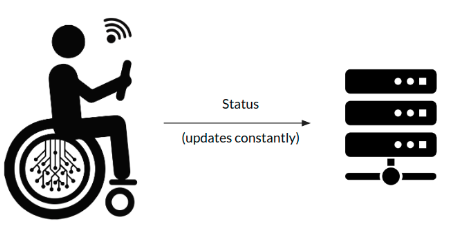

A server has been [developed](http://xcoa.av.it.pt/~pei2018-2019_g07/developer/server) using [Flask](http://flask.pocoo.org/). It communicates with a database made in [SQLite3](https://www.sqlite.org/index.html) that stores all the maps, users' credentials, wheelchairs and their usage history. This server is the bridge between the administrator dashboard and the wheelchair, i.e., it sends all the information stored in the database and deals with all the requests made by the dashboard. The server is also responsible to establish a communication between the mobile application and the wheelchair, since that a wheelchair's IP request can only be done by a logged in user.

 

When a wheelchair is online there is a constant one-way communication between it and the server. This way all the information displayed in the dashboard is correct and updated.
