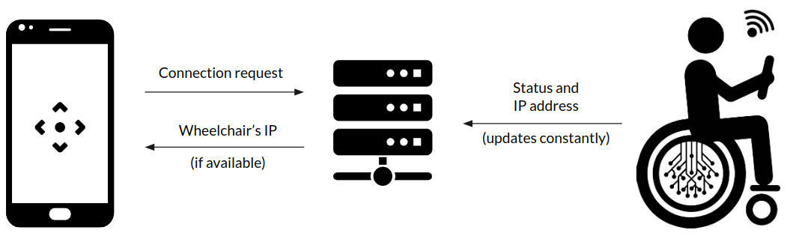
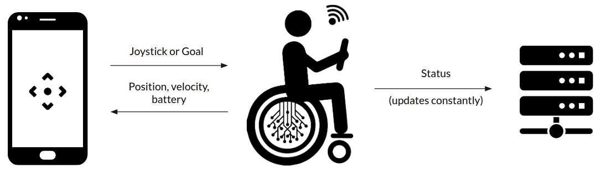
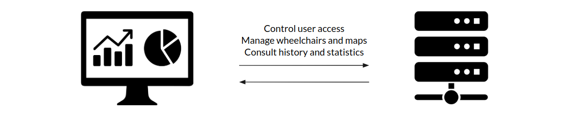

As depicted in the [client](../client/client.md) area, our system is easily divided in three main parts and although each part has their own architecture described in this section, they all interact with each other. 

## Connection

The first action an user makes when interacting with the wheelchair, is connecting to it using the mobile application which requests the wheelchair's IP address to the server. The server will return it if the wheelchair is available, otherwise the user will be informed that such action is not allowed. The server knows this because the wheelchair is constantly updating it with it's status and information.

---

## Movement

Once the mobile application obtains the wheelchair's IP address, it will talk to it directly sending joystick information, in manual control, or a goal in the navigation mode. The wheelchair then updates the mobile application wiht it's position, battery and velocity and the server with other information like history of actions.

---

## Managment

An administrator is capable of managing the system through a dashboard in which he can add or remove users and wheelchairs. This is needed beacause, as said in the requirements, the control of a wheelchair is exclusive to a single user simultaneously. In the wheelchair section of said dashboard, he can also change it's loaded map and disconnect the current user. He can also access all the existing maps, since each time a new one is generated, it is also stored in the server.