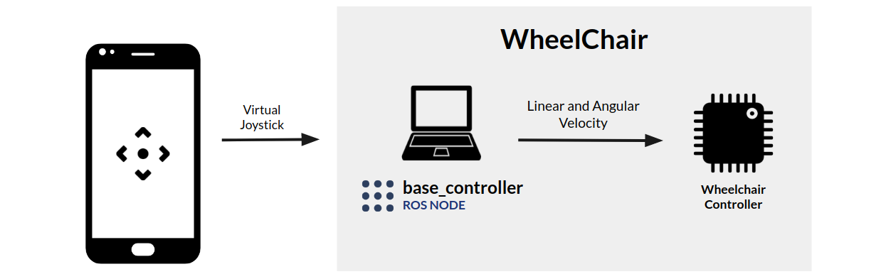
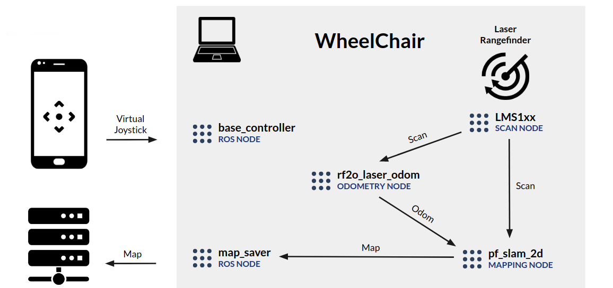
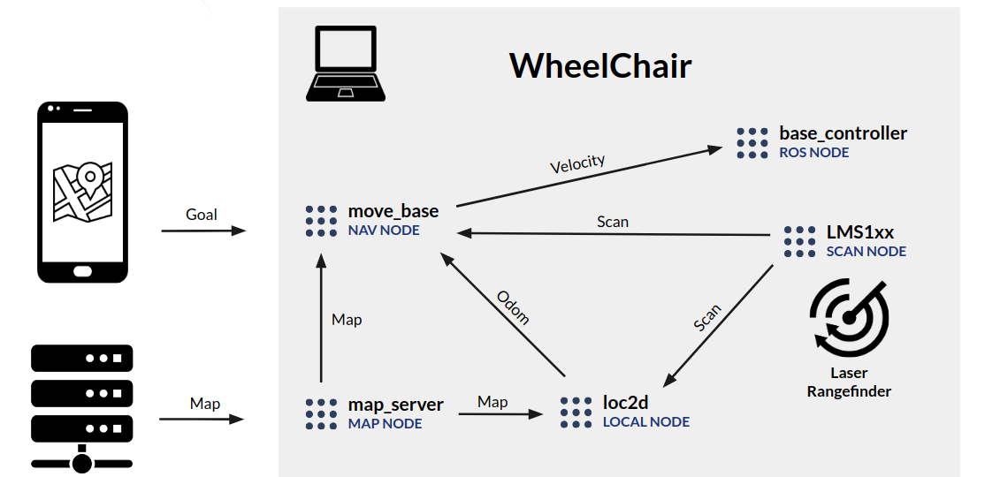

The core part of the wheelchair, linking every node in the system, is a laptop. It communicates with the wheelchair's control unit through a gateway microcontroller and processes information about every sensor in the wheelchair.
The wheelchair holds a camera for object recognition and collision detection, as well as a laser rangefinder and IMU for room mapping and navigation.  
In the software department, we are using [ROS](http://www.ros.org), which is a collection of software libraries for robot development. This allows us to have different nodes communicating with each other, exchanging information such as sensor data, wheelchair control data or velocity commands for the wheelchair's wheels.

---

## Manual Control

First, and probably the most important node of the system is the base controller node. This is the closest node to the gateway microcontroller of the wheelchair. It is responsible, not only, for reading the latest angular and linear velocity comands sent by the user / navigation stack, sending them to said gateway and making the chair move, but also for publishing all the control information that the chair responds with.

---

## Mapping

As stated previously, the mapping process is manually controlled by the user with the virtual joystick. To sucessfully generate a map, the wheelchair needs odometry values (change in position over time) and the scan values from the rangefinder. The scan values are provided by the laser driver node which already was present in the ROS libraries. The odometry is generated through a process which involves 2 nodes. The first filters the laser values to a specific angle because the default readings are too wide, and include the back of the wheelchair, which is not supposed to happen. Then we use another node that converts the sucession of laser values to proper odometry values that we can use to feed the mapping algorithm. This mapping algorithm was provided to us by investigator Eurico Pedrosa. Finally, we save the map to a file using another ROS node called map_saver, and transfer it to our server.

---

## Navigation

Since ROS already has a native navigation stack, we felt it was the right choice to adapt it to our hardware and use it for the navigation of the wheelchair. This navigation stack is a collection of nodes, being move_base the main one, and takes in information from odometry, sensor streams, a map server, as well as a goal pose and outputs safe velocity commands that are sent to the wheelchair. Like on the mapping stage, the scan values come from the same laser driver node and the map, previously generated and stored on the server, now comes from the map_server node. This time, for odometry, since we now have a map, we are using another node provided by Eurico, which takes in the map and laser scans and helps to improve the odometry, but this time it's not only change in position over time, it's also localization relative to the map. With all this information, move_base can output velocity values, which are then parsed and sent to the base_controller node and to the wheelchair, as seen before.
