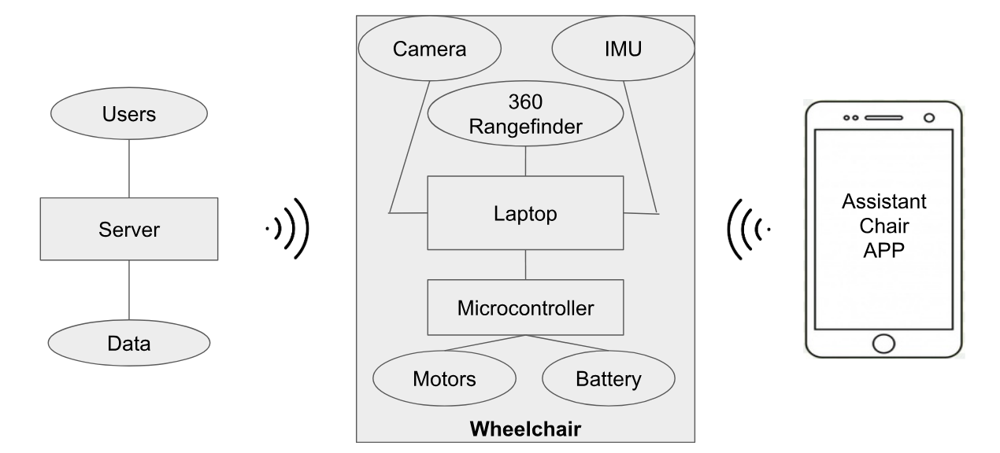

<<<<<<< HEAD
# UberChair

        

## Context
**UberChair** is not your typical eletric wheelchair. This chair was designed by our [team](/about.md) to help not only people with reduced mobility, but also regular people who need an extra "hand" at work or are too lazy. However, our focus will be with those who are disabled in order to provide them a better way of transportation.

---
## Problem
What has driven us to develop this product? Manual wheelchairs depend directly on its user and its mobility. Most of the times, the user is not strong enough to push himself so requires the help of another person. Also, in some specific cases, it can be very hard to the helper to drive those chairs.

---
## Features
* Manual control: a joystick emulation is available in the web app
* Voice control: the user can speak to the web app
* Predefined locations: the user can add default locations to the map
* Travel from point A to B: the chair can go from a predefined location to another by itself

---
## Architecture

---
## Risks and Issues
* Hit something or someone that appears right in front of the chair
* Fail of one motor which causes the chair to sharply turn
* The laptop runs out of battery

=======
# Client

aimed at someone wanting to understand the project context, objectives, high level planning among other information 
>>>>>>> c222f9702601fbd19df55f23df202a1719be93d9
