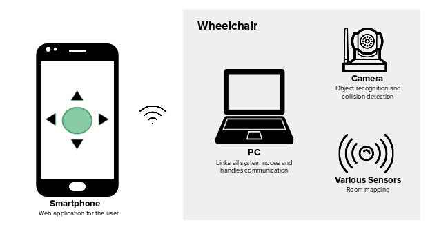

## Context
In many working envoriments, a person may need to do short travels between locations a lot of times during the day. While doing so, it wastes time, focus and energy. That same time could be used more efficiently if there was something that could take care of the mobility of the person for her. If there was a way for the person to travel between those short locations, but still remain focused on her work, be it on a computer or smartphone, it would increase that person's producticity by a large margin.

---
## Objectives
In that sense comes the IntelChair, a motorized wheelchair packed with sensors and a computer, that takes care of transporting people from location to location, without it's user ever need to pay atention to the course of the deslocation. It does so by learning it's environment, presenting the user with a top-down view of said enviroment and letting him choose where he wants to go. The interaction between the chair and the user is done through an application on his smartphone.

---
## How it works

---
## Features
* Manual control of the chair through a joystick in the web application
* Voice control. The user can speak to the web app and control the chair
* Autonomous room mapping done by the chair
* Call the chair to the user’s location
* Have the chair follow the user
* Travel from point A to B. The chair can go from a location to another by itself
* Predefined locations. The user can add default locations to the map

---
## Risks and Issues
* Hitting something that was not previously mapped by the chair
* Failure of connection between the user and the chair
* Making sure only one user controls the chair at a time
* The elemntes of the enviroment may change drastically
* Placing the sensors in the chair so they are functional and not interfere with the user
* The laptop runs out of battery

