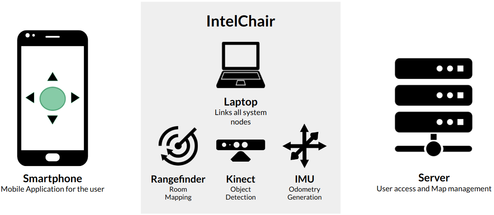

## Context
In many working envoriments, a person may need to do short travels between locations a lot of times during the day. While doing so, it wastes time, focus and energy. That same time could be used more efficiently if there was something that could take care of the mobility of the person for her. If there was a way for the person to travel between those short locations, but still remain focused on her work, be it on a computer or smartphone, it would increase that person's producticity by a large margin.

---
## Objectives
In that sense comes the IntelChair, a motorized wheelchair packed with sensors and a computer, that takes care of transporting people from location to location, without it's user ever need to pay atention to the course of the deslocation. It does so by learning it's environment, presenting the user with a top-down view of said enviroment and letting him choose where he wants to go. The interaction between the chair and the user is done through an application on his smartphone.

---
## How it works

---
## Features
* Manual control: a joystick emulation is available in the web app
* Voice control: the user can speak to the web app
* Autonomous room mapping done by the chair
* Call the chair to the user’s location
* Travel from point A to B: the chair can go from a predefined location to another by itself
* Predefined locations: the user can add default locations to the map

---
## Risks and Issues
* Hit something or someone that appears right in front of the chair
* Fail of one motor which causes the chair to sharply turn
* The laptop runs out of battery

