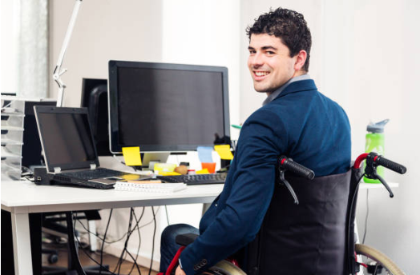
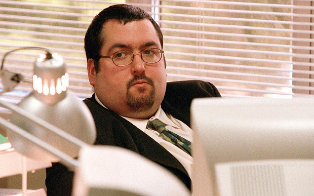

##Ramalho

{: style="width:300px"}

**Researcher** 
A 32 year old man, with leg paralysis who spends most of his time working as a researcher in a software engineering office using his non-assisted wheelchair. Moving his chair by hand all day can get tiring, and because his hands are occupied while he is moving from point A to B he is completely unproductive.

---

##Rogério

{: style="width:300px"}

**Teacher** 
Rogério is a 43 year old teacher at University of Aveiro and spends most of his time working in IRIS Lab. On a daily basis he sits on different desks and working stations, be them soldering, printing or the coffee station. He also moves things around the laboratory depending on what he is working at the moment. More often than Rogério would desire, he also needs to leave the laboratory to get components from other locations.